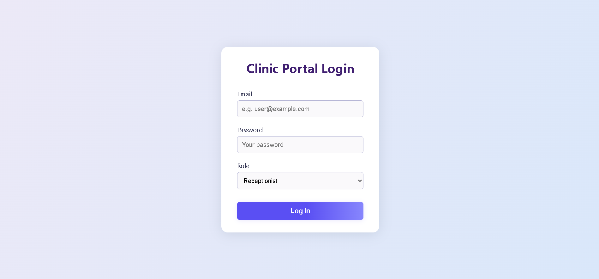
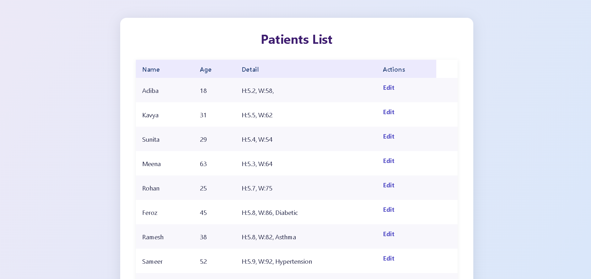
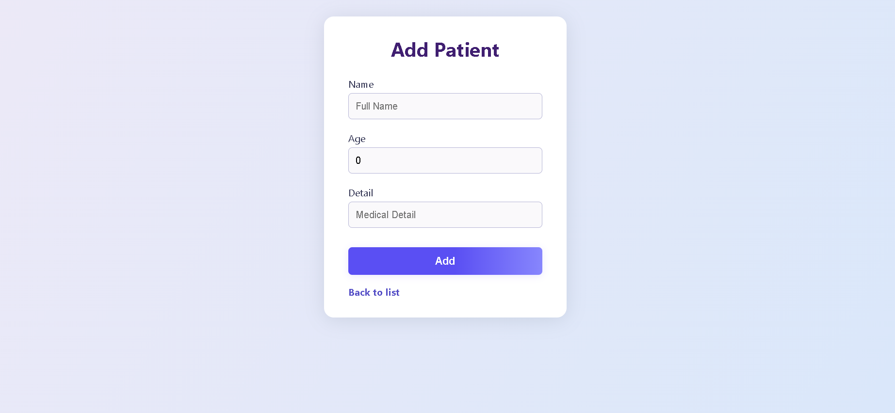
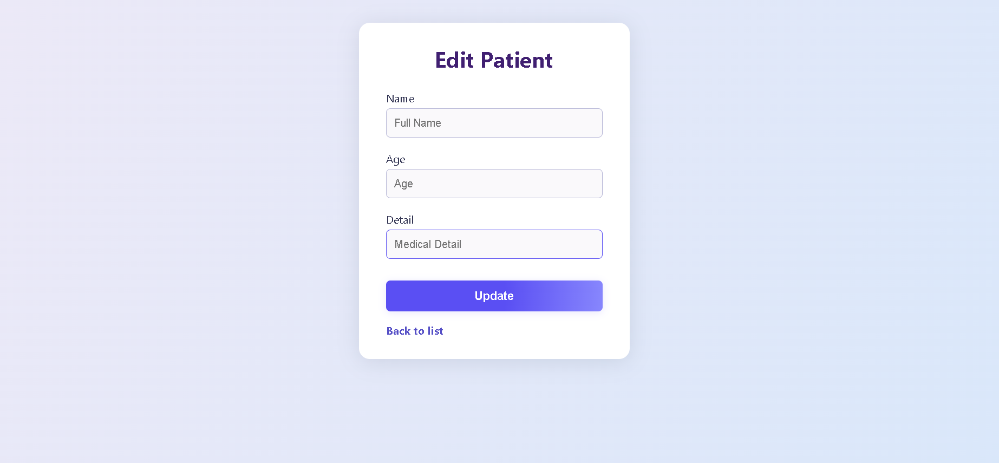

# Clinic Portal

A clinic portal system built with Go, Gin, GORM, and PostgreSQL.


## Overview

This Clinic Portal is a web application designed for medical clinics to manage patients, and user roles. It provides different functionality based on user roles (doctor or receptionist) with a clean interface.

## Features

- **User Authentication**: Secure login system with role-based access control
- **Patient Management**: Complete CRUD operations for patient records
- **Role-Based Permissions**:
  - **Receptionist**: Full access to create, read, update, and delete patient records
  - **Doctor**: Limited to viewing and editing patient information
- **Responsive UI**: Professional, centered login form and intuitive interface
- **Comprehensive Testing**: Full test suite for models, controllers, and middleware

## Technology Stack

- **Backend**: Go with Gin web framework
- **Database**: PostgreSQL with GORM ORM
- **Frontend**: HTML, CSS (responsive design)
- **Authentication**: Session-based authentication (cookie)
- **Testing**: Go's built-in testing package with testify/assert

## Project Structure

```
golang-clinic-portal/
│
├── cmd/
│   └── main.go                       # Application entry point
│
├── controllers/
│   ├── auth.go                       # Authentication logic
│   ├── auth_test.go                  # Tests for authentication
│   ├── patient.go                    # Patient management
│   ├── patient_test.go               # Tests for patient management
│   └── routes.go                     # Route definitions
│
├── middleware/
│   ├── auth.go                       # Authentication middleware
│   └── auth_test.go                  # Tests for auth middleware
│
├── models/
│   ├── user.go                       # User model definition
│   ├── user_test.go                  # Tests for user model
│   ├── patient.go                    # Patient model definition
│   └── patient_test.go               # Tests for patient model
│
├── templates/
│   ├── login.html                    # Login page template
│   ├── patients.html                 # Patient listing template
│   └── edit_patient.html             # Patient edit template
│
├── static/
│   └── style.css                     # Application styling
│
├── test_helper.go                    # Helper functions for tests
├── go.mod                            # Go module file
├── go.sum                            # Go module checksum file
├── .env                              # Environment configuration
└── README.md                         # Project documentation
```

## Installation

### Prerequisites

- Go 1.16+
- PostgreSQL
- Git

### Setup Steps

1. **Clone the repository**

```bash
git clone https://github.com/mani2002/golang-clinic-portal.git
cd golang-clinic-portal
```

2. **Install dependencies**

```bash
go mod download
```

3. **Set up your database**

Create a PostgreSQL database and update the .env file with your credentials:

```
DB_HOST=localhost
DB_PORT=5432
DB_USER=postgres
DB_PASSWORD=postgres
DB_NAME=clinicdb
JWT_SECRET=your_jwt_secret
```
4. **Start database**

```bash
sudo service postgresql start
```
5. **Create database tables and seed users**

The application will automatically create tables on first run. After that, you can seed users:

```sql
-- Run in PostgreSQL
INSERT INTO users (email, password, role, created_at, updated_at)
VALUES
  ('receptionist@example.com', '$2a$10$bYn1c5xet/kfvGnZpyM/wuq3LE7wdWBR9DebiQv.hiutn9f4HNmRC', 'receptionist', now(), now()),
  ('doctor@example.com', '$2a$10$bYn1c5xet/kfvGnZpyM/wuq3LE7wdWBR9DebiQv.hiutn9f4HNmRC', 'doctor', now(), now());

-- The hashed password is "password123"
```

5. **Run the application**

```bash
go run cmd/main.go
```

The application will be available at http://localhost:8080

## Testing

The application includes a comprehensive test suite covering models, controllers, and middleware.

### Running Tests

Run all tests:

```bash
go test ./...
```

Run tests for specific packages:

```bash
go test ./models
go test ./controllers
go test ./middleware
```

Run tests with verbose output:

```bash
go test -v ./...
```


## Usage

### Login

Navigate to http://localhost:8080/login and use the following credentials:

- **Receptionist**:
  - Email: receptionist@example.com
  - Password: password123
  - Role: Receptionist

- **Doctor**:
  - Email: doctor@example.com
  - Password: password123
  - Role: Doctor

### Patient Management

- **View Patients**: Both doctors and receptionists can view the list of patients
- **Add Patient**: Only receptionists can add new patients
- **Edit Patient**: Both roles can edit patient details
- **Delete Patient**: Only receptionists can delete patient records

## Screenshots

### Login Page


### Patients List


### Add Patient


### Edit Patient



## API Endpoints

| Method | Path                   | Description                   | Role Access      |
|--------|------------------------|-------------------------------|------------------|
| GET    | /login                 | Show login page               | All              |
| POST   | /login                 | Process login                 | All              |
| GET    | /patients              | List all patients             | Doctor/Reception |
| GET    | /patients/new          | Show new patient form         | Reception only   |
| POST   | /patients/new          | Create new patient            | Reception only   |
| GET    | /patients/edit/:id     | Show edit form for patient    | Doctor/Reception |
| POST   | /patients/edit/:id     | Update patient                | Doctor/Reception |
| POST   | /patients/delete/:id   | Delete patient                | Reception only   |


## Acknowledgments

- [Gin Web Framework](https://github.com/gin-gonic/gin)
- [GORM ORM Library](https://gorm.io/)
- [bcrypt for Go](https://pkg.go.dev/golang.org/x/crypto/bcrypt)
- [Testify Assert Library](https://github.com/stretchr/testify)

---